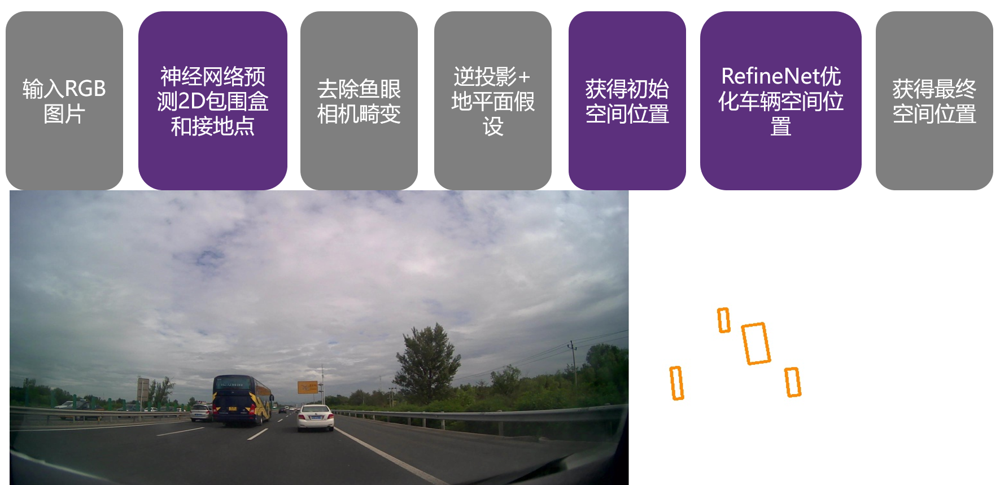

# 介绍
代码修改自CenterNet开源代码：CenterNet https://github.com/xingyizhou/CenterNet
整体步骤为：
1. CenterNet接地点检测
2. IPM逆投影
3. RefineNet鸟瞰图优化

如上图所示，紫色框是深度学习方法，灰色框是几何优化方法。
输入一张图片，使用CenterNet神经网络在图像上预测2D包围盒和接地点，
接着去除鱼眼相机畸变,使用地平面假设和逆投影推断车辆空间位置，
得到车辆初始空间位置，最后使用RefineNet优化空间位置，得到车辆空间位置鸟瞰图。
图1下半部分是效果图：左侧是输入的图片，右侧是输出的汽车空间位置鸟瞰图。
每一个黄色矩形代表一个汽车的空间位置。例如最右侧的小黄色矩形是图片中白色车辆的空间位置，
中间较大的黄色矩形是图片中大客车的空间位置。

# 运行说明
本代码在CenterNet的基础上修改，
首先需要按照CenterNet https://github.com/xingyizhou/CenterNet 
的要求配置好CenterNet的环境。然后在CenterNet的环境下进行实验。
本代码结果保存路径与CenterNet相同。

我准备了如下脚本，分别对图片进行推理和鸟瞰图预测：
src/seq3infer.sh
脚本里需要的两个模型CenterNetModel.pth和RefineNetModel.pth另外提供。
脚本里参数img_nogt_dir 表示需要推理的图片文件夹路径
推理结果以文件形式保存在CenterNet的实验文件夹exp/multi_pose_3d/seq3/val/epoch130/中

# 代码说明
本代码是在CenterNet代码上修改，入口文件为src/test_3d_train.py和src/test_3d_val.py，
分别为RefineNet的训练和验证代码。

src/test_3d_train.py训练代码是使用已经训练好的CenterNet接地点检测模型，进行去畸变、逆投影，并训练RefineNet。

src/test_3d_val.py验证代码是验证接地点检测、去畸变、逆投影、鸟瞰图优化等的效果。

